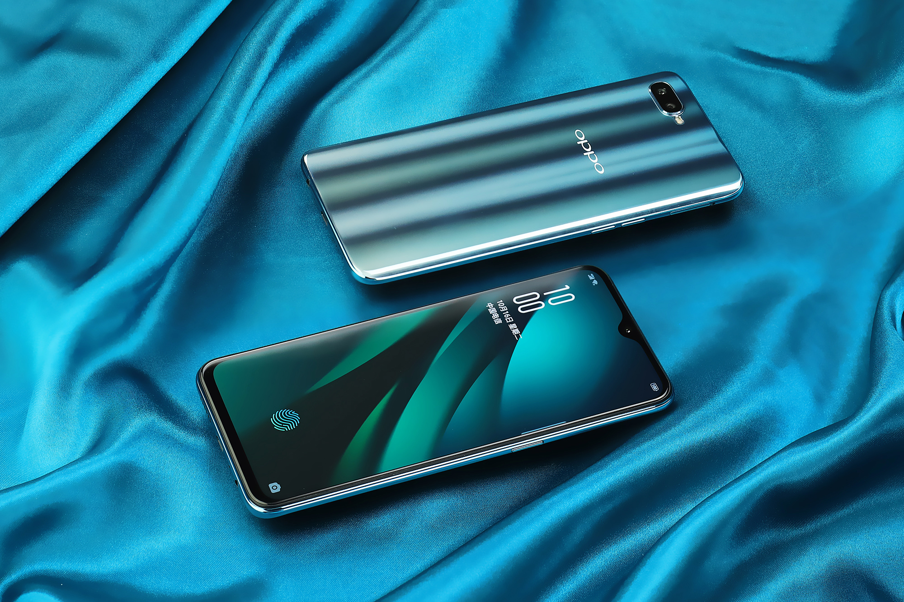

 # OrangeFox device tree

 <link rel="stylesheet" href="1.css">

<b>Clone Command</b> :

```
git clone https://github.com/ghhccghk/twrp_device_oppo_PBCM10.git -b android-11 device/OPPO/PBCM10
```

  Device configuration for OPPO R15x
 =========================================

  The OPPO R15x (codenamed "PBCM10") is an
budget smartphone from Intex.

  It was announced and released in October 2018.

  ## Device specifications

  Basic | Spec Sheet
 -------:|:-------------------------
 SoC | Qualcomm 660 AIE
 CPU | 4x Qualcomm Kryo 260 LP @ 1843 MHz 4x Qualcomm Kryo 260 HP @ 1958 MHz
 Clock Speed | ( 633 - 1958 MHz )
 GPU | Adreno 512
 GPU Vendor | Qualcomm
 Clock Speed | ( 160 - 585 MHz )
 Memory | 6 GB RAM  ( LPDDR4X_1866 )
 Shipped Android Version | 8.1
 Storage | 128 GB
 MicroSD | Up to 256 GB (dedicated slot)
 Battery | Removable Li-ion 3600 mAh battery
 Dimensions | 158.3 x 75.5 x 7.4 mm
 Display | 1080 x 2340 pixels, 19:9 ratio, 6.40 inches (320 dpi density  (xhdpi))
<b>Rear camera one</b> | 20 MP, Diagonal : 3.35 mm
 Vendor | none
 Model | none
<b>Rear camera two</b> | 1.9 MP, Diagonal : 2.21 mm
 Vendor | none
 Model | none
<b>Front camera</b> | 5 MP, Diagonal : 3.28 mm
 Vendor | none
 Model | none
 **Flash** | Samsung 3V6CMB
 Flash Size | 128GB
 Camera2 API | Legacy
 Touchscreen | synaptics-s3706
 Screenfingerprints | fpc1020
 Accelerometer & Linear Accelerometer Unit & Gyroscope  | BOSCH BMI160
 E-compass | AKM AK09911
 Ambient Light Sensor | ams AG TSL2540
 Sound | sdm660sndcardmt
 Charger | SUNWODA


  ## Device picture

<div align="center">
	<a href="../..">
		
	</a>
</div>

<div align="center">
	<a href="../..">
		
	</a>
</div>

<div align="center">
	<a href="../..">
		
	</a>
</div>

