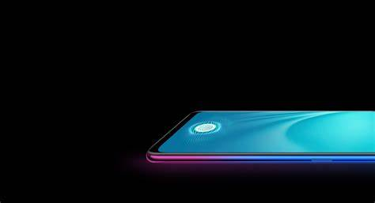

 # OrangeFox device tree

<b>Clone Command</b> :

```
git clone https://github.com/ghhccghk/twrp_device_oppo_PBCM10.git -b android-11 device/OPPO/PBCM10
```

  Device configuration for OPPO R15x
 =========================================

  The OPPO R15x (codenamed "PBCM10") is an
budget smartphone from Intex.

  It was announced and released in October 2018.

  ## Device specifications

  Basic | Spec Sheet
 -------:|:-------------------------
 SoC | Qualcomm 660 AIE
 CPU | 4x Qualcomm Kryo 260 LP @ 1843 MHz 4x Qualcomm Kryo 260 HP @ 1958 MHz
 Clock Speed | ( 633 - 1958 MHz )
 GPU | Adreno 512
 GPU Vendor | Qualcomm
 Clock Speed | ( 160 - 585 MHz )
 Memory | 6 GB RAM  ( LPDDR4X_1866 )
 Shipped Android Version | 8.1
 Storage | 128 GB
 MicroSD | Up to 256 GB (dedicated slot)
 Battery | Removable Li-ion 3600 mAh battery
 Dimensions | 158.3 x 75.5 x 7.4 mm
 Display | 1080 x 2340 pixels, 19:9 ratio, 6.40 inches (320 dpi density  (xhdpi))
<b>Rear camera one</b> | 20 MP, Diagonal : 3.35 mm
 Vendor | none
 Model | none
<b>Rear camera two</b> | 1.9 MP, Diagonal : 2.21 mm
 Vendor | none
 Model | none
<b>Front camera</b> | 5 MP, Diagonal : 3.28 mm
 Vendor | none
 Model | none
 **Flash** | Samsung 3V6CMB
 Flash Size | 128GB
 Camera2 API | Legacy
 LCM | r69339_sampl
 Touchscreen | synaptics-s3706
 Screenfingerprints | fpc1020
 Accelerometer & Linear Accelerometer Unit & Gyroscope  | BOSCH BMI160
 E-compass | AKM AK09911
 Ambient Light Sensor | ams AG TSL2540
 Sound | sdm660sndcardmt
 Charger | SUNWODA


  ## Device picture

<div align="center">
	<a href="../..">
		
	</a>
</div>

<div align="center">
	<a href="../..">
		
	</a>
</div>

<div align="center">
	<a href="../..">
		
	</a>
</div>

/* 全局属性
 * 页边距 padding: 30px;
 * 全文字体 font-family: ptima-Regular;
 * 英文换行 word-break: break-all;
 */
#nice {
}
/* 段落，下方未标注标签参数均同此处
 * 上边距 margin-top: 5px;
 * 下边距 margin-bottom: 5px;
 * 行高 line-height: 26px;
 * 词间距 word-spacing: 3px;
 * 字间距 letter-spacing: 3px;
 * 对齐 text-align: left;
 * 颜色 color: #3e3e3e;
 * 字体大小 font-size: 16px;
 * 首行缩进 text-indent: 2em;
 */
#nice p {
}
/* 一级标题 */
#nice h1 {
}
/* 一级标题内容 */
#nice h1 .content {
}
/* 一级标题修饰 请参考有实例的主题 */
#nice h1:after {
}
/* 二级标题 */
#nice h2 {
  border-bottom: 2px solid rgb(239, 112, 96);
  font-size: 1.3em;
}
/* 二级标题内容 */
#nice h2 .content {
  display: inline-block;
  font-weight: bold;
  background: rgb(239, 112, 96);
  color: #ffffff;
  padding: 3px 10px 1px;
  border-top-right-radius: 3px;
  border-top-left-radius: 3px;
  margin-right: 3px;
}
/* 二级标题修饰 请参考有实例的主题 */
#nice h2:after {
  display: inline-block;
  content: " ";
  vertical-align: bottom;
  border-bottom: 36px solid #efebe9;
  border-right: 20px solid transparent;
}
/* 三级标题 */
#nice h3 {
}
/* 三级标题内容 */
#nice h3 .content {
}
/* 三级标题修饰 请参考有实例的主题 */
#nice h3:after {
}
/* 无序列表整体样式
 * list-style-type: square|circle|disc;
 */
#nice ul {
}
/* 有序列表整体样式
 * list-style-type: upper-roman|lower-greek|lower-alpha;
 */
#nice ol {
}
/* 列表内容，不要设置li
 */
#nice li section {
}
/* 引用
 * 左边缘颜色 border-left-color: black;
 * 背景色 background: gray;
 */
#nice blockquote {
  border-left-color: rgb(239, 112, 96);
  background: #fff9f9;
}
/* 引用文字 */
#nice blockquote p {
}
/* 链接
 * border-bottom: 1px solid #009688;
 */
#nice a {
  color: rgb(239, 112, 96);
  border-bottom: 1px solid rgb(239, 112, 96);
}
/* 加粗 */
#nice strong {
}
/* 斜体 */
#nice em {
}
/* 加粗斜体 */
#nice em strong {
}
/* 删除线 */
#nice del {
}
/* 分隔线
 * 粗细、样式和颜色
 * border-top: 1px solid #3e3e3e;
 */
#nice hr {
}
/* 图片
 * 宽度 width: 80%;
 * 居中 margin: 0 auto;
 * 居左 margin: 0 0;
 */
#nice img {
}
/* 图片描述文字 */
#nice figcaption {
}
/* 行内代码 */
#nice p code, #nice li code {
  color: rgb(239, 112, 96);
}
/* 非微信代码块
 * 代码块不换行 display: -webkit-box !important;
 * 代码块换行 display: block;
 */
#nice pre code {
}
/*
 * 表格内的单元格
 * 字体大小 font-size: 16px;
 * 边框 border: 1px solid #ccc;
 * 内边距 padding: 5px 10px;
 */
#nice table tr th,
#nice table tr td {
}
/* 脚注文字 */
#nice .footnote-word {
  color: #ff3502;
}
/* 脚注上标 */
#nice .footnote-ref {
  color: rgb(239, 112, 96);
}
/* "参考资料"四个字
 * 内容 content: "参考资料";
 */
#nice .footnotes-sep:before {
}
/* 参考资料编号 */
#nice .footnote-num {
}
/* 参考资料文字 */
#nice .footnote-item p {
}
/* 参考资料解释 */
#nice .footnote-item p em {
}
/* 行间公式
 * 最大宽度 max-width: 300% !important;
 */
#nice .block-equation svg {
}
/* 行内公式
 */
#nice .inline-equation svg {
}
